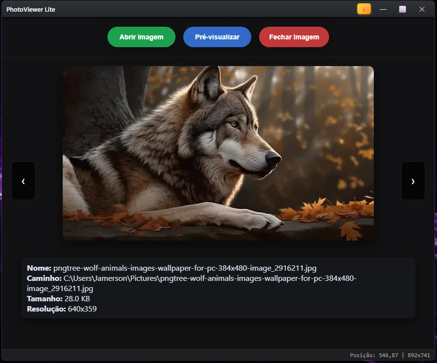
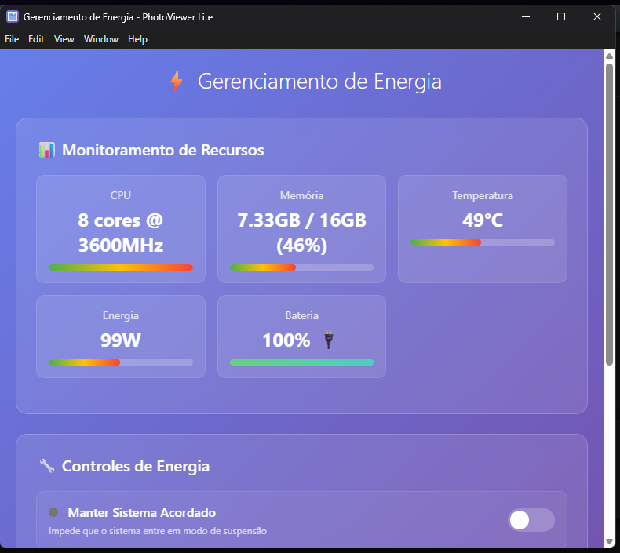
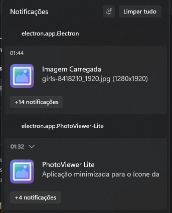

# 📷 PhotoViewer Lite v1.1.1

> **Visualizador de imagens moderno e avançado desenvolvido em Electron**

Um aplicativo desktop completo que combina visualização de imagens com sistema integrado de **gerenciamento de energia**, oferecendo uma experiência profissional e recursos únicos para usuários avançados.

[](https://electronjs.org/)
[](LICENSE)
[](#-builds-multiplataforma)
[](package.json)

---

## 📸 Screenshots

### Interface Principal


### Gerenciamento de Energia


### Sistema de Notificações


---

## 🌟 Destaques do Projeto

- 🖼️ **Visualizador Avançado**: Interface moderna com navegação intuitiva entre imagens
- ⚡ **Gerenciamento de Energia**: Sistema completo de monitoramento e controle energético
- 🎨 **Interface Customizada**: Janela sem moldura com design glassmorphism
- 🔔 **Sistema de Notificações**: Notificações elegantes e não intrusivas
- 🏷️ **Integração com Sistema**: Bandeja do sistema e atalhos globais
- 🌐 **Multiplataforma**: Builds para Windows e Linux
- 📊 **Monitoramento em Tempo Real**: CPU, memória e recursos do sistema

---

## 🚀 Funcionalidades Principais

### 🖼️ Visualização de Imagens

- **Carregamento Inteligente**: Suporte a múltiplos formatos de imagem
- **Navegação Fluida**: Setas do teclado ou botões para navegar entre imagens da pasta
- **Informações Detalhadas**: Nome, caminho, tamanho e resolução da imagem
- **Janela de Pré-visualização**: Janela flutuante independente (Ctrl+Shift+P)
- **Zoom e Ajuste**: Interface responsiva que se adapta ao tamanho da imagem

### ⚡ Gerenciamento de Energia

- **Monitoramento em Tempo Real**: 
  - Uso de CPU e memória
  - Temperatura do sistema
  - Status da bateria (laptops)
  - Consumo energético
- **Controles Avançados**:
  - PowerSaveBlocker (impede suspensão automática)
  - Modo de baixo consumo
  - Otimização de recursos
  - Perfis de energia personalizados

### 🎨 Interface e Experiência

- **Barra de Título Customizada**: Controles personalizados (minimizar, maximizar, fechar)
- **Atalhos Globais**: 
  - `Ctrl+Alt+←/→`: Ajustar janela para metade da tela
  - `Ctrl+Alt+↑`: Maximizar respeitando área de trabalho
  - `Ctrl+Alt+↓`: Restaurar tamanho padrão centralizado
  - `Ctrl+Shift+P`: Abrir pré-visualização
- **Sistema de Bandeja**: Minimização para área de notificação
- **Persistência de Estado**: Lembra posição e tamanho da janela

### 🔔 Sistema de Notificações

- **Design Moderno**: Estilo glassmorphism com animações suaves
- **Tipos Configuráveis**: Sucesso, aviso, erro e informação
- **Não Intrusivo**: Posicionamento inteligente e duração configurável
- **Integração com Sistema**: Notificações nativas do SO quando minimizado

---

## 🛠️ Tecnologias Utilizadas

| Tecnologia | Versão | Propósito |
|------------|--------|-----------|
| **Electron** | 37.4.0 | Framework principal para aplicação desktop |
| **Node.js** | Latest | Runtime JavaScript para backend |
| **HTML5/CSS3** | - | Interface moderna e responsiva |
| **JavaScript ES6+** | - | Lógica da aplicação e interações |
| **electron-packager** | 17.1.2 | Empacotamento multiplataforma |
| **electron-reload** | 2.0.0 | Hot reload durante desenvolvimento |
| **Sharp** | 0.34.4 | Processamento de imagens |

---

## 📁 Estrutura do Projeto

```
ImageViewerElectron/
├── 📁 assets/
│   └── 📁 icons/           # Ícones personalizados (16x16, 32x32, 64x64)
├── 📁 dist/               # Builds compiladas
│   ├── 📁 PhotoViewer-Lite-win32-x64/    # Build Windows
│   └── 📁 PhotoViewer-Lite-linux-x64/    # Build Linux
├── 📁 references/         # Documentação e links de estudo
├── 🔧 main.js            # Processo principal do Electron
├── 🎨 renderer.js        # Lógica da interface (processo renderer)
├── 🔒 preload.js         # Ponte de segurança entre main e renderer
├── 🔔 notifications.js   # Sistema de notificações elegante
├── 🖼️ index.html         # Interface principal
├── ⚡ power-management.html # Interface de gerenciamento de energia
├── 🎨 styles.css         # Estilos da aplicação
├── 🪟 build.bat          # Script de build para Windows
├── 🐧 build-linux.sh     # Script de build para Linux
├── 📦 package.json       # Configurações e dependências
└── 📚 README.md          # Esta documentação
```

---

## 🚀 Instalação e Uso

### Pré-requisitos

- **Node.js** 16+ ([Download](https://nodejs.org/))
- **npm** (incluído com Node.js)
- **Git** ([Download](https://git-scm.com/))

### 1. Clone o Repositório

```bash
git clone https://github.com/jamersonnascimento/ImageViewerElectron.git
cd ImageViewerElectron
```

### 2. Instale as Dependências

```bash
npm install
```

### 3. Execute em Modo Desenvolvimento

```bash
npm start
```

---

## 🏗️ Builds Multiplataforma

### Windows

```bash
# Método 1: Script automatizado
.\build-windows.bat

# Método 2: Comando direto
npm run package
```

**Executável gerado**: `dist\PhotoViewer-Lite-win32-x64\PhotoViewer-Lite.exe`

### Linux

```bash
# Método 1: Script automatizado
chmod +x build-linux.sh
./build-linux.sh

# Método 2: Comando direto
npm run package:linux
```

**Executável gerado**: `dist/PhotoViewer-Lite-linux-x64/PhotoViewer-Lite`

### Características das Builds

- **Portáteis**: Não requerem instalação
- **Independentes**: Incluem runtime do Electron
- **Otimizadas**: ~285-293 MB por plataforma
- **Cross-compilation**: Pode buildar para Linux a partir do Windows

---

## 🎮 Guia de Uso

### Controles Básicos

| Ação | Método |
|------|--------|
| **Abrir Imagem** | Botão "Abrir Imagem" ou arrastar arquivo |
| **Navegar** | Setas ←/→ do teclado ou botões na interface |
| **Pré-visualização** | Botão "Pré-visualizar" ou `Ctrl+Shift+P` |
| **Fechar Imagem** | Botão "Fechar Imagem" |
| **Gerenciar Energia** | Botão ⚡ na barra de título |

### Atalhos Avançados

| Atalho | Função |
|--------|--------|
| `Ctrl+Alt+←` | Ajustar janela para metade esquerda |
| `Ctrl+Alt+→` | Ajustar janela para metade direita |
| `Ctrl+Alt+↑` | Maximizar janela |
| `Ctrl+Alt+↓` | Restaurar tamanho padrão |
| `Ctrl+Shift+P` | Abrir janela de pré-visualização |

### Sistema de Bandeja

- **Minimizar**: Clique no X para enviar para bandeja
- **Restaurar**: Clique no ícone da bandeja
- **Fechar Completamente**: Menu de contexto da bandeja

---

## 🔧 Desenvolvimento

### Estrutura de Processos

O PhotoViewer Lite segue a arquitetura multi-processo do Electron:

- **Main Process** (`main.js`): Gerencia janelas, sistema e APIs nativas
- **Renderer Process** (`renderer.js`): Interface do usuário e interações
- **Preload Script** (`preload.js`): Ponte segura entre main e renderer

### APIs Principais

```javascript
// Controles de janela
window.electronAPI.minimize()
window.electronAPI.maximizeRestore()
window.electronAPI.close()

// Manipulação de imagens
window.electronAPI.openImage()
window.electronAPI.nextImage()
window.electronAPI.previousImage()

// Gerenciamento de energia
window.electronAPI.togglePowerSaveBlocker()
window.electronAPI.getSystemInfo()
window.electronAPI.optimizeResources()
```

### Hot Reload

Durante o desenvolvimento, o `electron-reload` monitora mudanças nos arquivos e recarrega automaticamente a aplicação.

---

## 🎨 Personalização

### Temas e Estilos

O arquivo `styles.css` contém toda a estilização da aplicação:

- **Variáveis CSS**: Cores e dimensões centralizadas
- **Glassmorphism**: Efeitos de vidro e transparência
- **Responsividade**: Adaptação a diferentes tamanhos de tela
- **Animações**: Transições suaves e feedback visual

### Sistema de Notificações

Personalize notificações em `notifications.js`:

```javascript
const notification = new NotificationSystem();
notification.show('Título', 'Mensagem', 'success');
```

Tipos disponíveis: `success`, `warning`, `error`, `info`

---

## 🐛 Troubleshooting

### Problemas Comuns

| Problema | Solução |
|----------|---------|
| **Erro ao buildar** | Execute `npm install` e tente novamente |
| **Imagem não carrega** | Verifique se o formato é suportado (JPG, PNG, GIF, etc.) |
| **Janela não abre** | Verifique se não há outro processo rodando |
| **Atalhos não funcionam** | Execute como administrador (Windows) |

### Logs e Debug

- **Modo Desenvolvimento**: Abra DevTools com `Ctrl+Shift+I`
- **Logs do Sistema**: Verifique console do terminal
- **Arquivos de Estado**: Localizados em `%APPDATA%/imageviewerelectron/`

---

## 🤝 Contribuição

Contribuições são bem-vindas! Para contribuir:

1. **Fork** o projeto
2. **Crie** uma branch para sua feature (`git checkout -b feature/AmazingFeature`)
3. **Commit** suas mudanças (`git commit -m 'Add some AmazingFeature'`)
4. **Push** para a branch (`git push origin feature/AmazingFeature`)
5. **Abra** um Pull Request

### Diretrizes

- Mantenha o código limpo e documentado
- Teste em múltiplas plataformas quando possível
- Siga os padrões de código existentes
- Atualize a documentação conforme necessário

---

## 📄 Licença

Este projeto está licenciado sob a **MIT License** - veja o arquivo [LICENSE](LICENSE) para detalhes.

---

## 👨‍💻 Autor

**Jamerson Nascimento**

- GitHub: [@jamersonnascimento](https://github.com/jamersonnascimento)
- Email: [seu-email@exemplo.com](mailto:seu-email@exemplo.com)

---

## 🙏 Agradecimentos

- **Professor Alexandre Ferreira** - Proposta do desafio e orientação
- **Comunidade Electron** - Framework incrível e documentação
- **Comunidade Open Source** - Inspiração e recursos

---

## 📊 Status do Projeto

- ✅ **Funcionalidades Core**: Completas
- ✅ **Interface**: Design moderno implementado
- ✅ **Builds Multiplataforma**: Windows e Linux
- ✅ **Documentação**: Completa e atualizada
- 🔄 **Melhorias Futuras**: Suporte a macOS, mais formatos de imagem

---

<div align="center">

**⭐ Se este projeto foi útil, considere dar uma estrela!**

[🐛 Reportar Bug](https://github.com/jamersonnascimento/ImageViewerElectron/issues) • [💡 Sugerir Feature](https://github.com/jamersonnascimento/ImageViewerElectron/issues) • [📚 Documentação](BUILD.md)

</div>